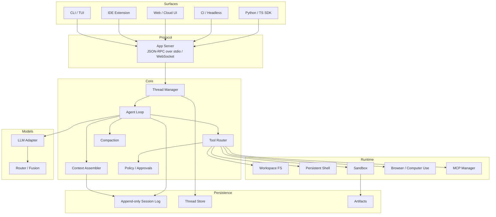

# 架构草图

本文是 [技术方案](./tech-proposal.md) 的实现级附录：分层、协议、仓库目录、核心循环。实现时以本文为骨架，以技术方案为取舍依据。

## 1. 分层



三条硬边界：

| 边界 | 左边 | 右边 | 为什么拆 |
| --- | --- | --- | --- |
| Protocol | Surfaces | Core | CLI / IDE / Cloud 必须共用同一套事件，不能各写一套 loop |
| Tool seam | Loop | Runtime | 本地进程、Docker、远端 VM 只换 provider，不换工具 schema |
| Conversation | Loop | Session log | 机器可以休眠/销毁，会话必须可恢复、可 fork、可 replay |

这对应 Cursor 后来拆开的三件事：agent loop、machine state、conversation state。第一天就要拆，不要等上云再拆。

## 2. 核心对象

```text
Workspace  一份可执行的工程环境（git worktree / container / VM）
Thread     一次持久会话（可 resume / fork / archive）
Turn       用户一次输入触发的工作单元（含多轮 inference + tool）
Step       一次模型请求 + 它产生的 tool calls
Item       流式原子：user / assistant / reasoning / tool / approval / diff
```

对齐 Codex 的 Thread → Turn → Item。DeepSeek 用 Session / Turn / Step，语义等价。我们采用 Codex 命名，便于对照开源实现。

Item 生命周期必须稳定：

```text
started → delta* → completed
          ↘ failed / interrupted
```

客户端只渲染 Item 事件，不解析模型原始 SSE。这样换模型供应商不会把 UI 一起换掉。

## 3. Agent Loop

```text
turn/start
  claim inbox (user message + injected context)
  assemble prompt sections + tool schemas   # 必须前缀稳定
  loop step:
    llm/stream
      reasoning / output / function_call
    for each tool call:
      policy check → approval? → execute → truncate → append
    if no more tool calls and no pending inbox:
      assistant message → turn/end
    if context pressure:
      compact (cache-aware) → continue
turn/end
```

实现约束：

1. **旧 prompt 必须是新 prompt 的精确前缀**，直到 compaction 发生。这是 prompt cache 的全部秘密。
2. **模型看见的每一段文字都必须能从 session log 重建**。注入上下文、系统提示变更、tool 结果截断，全部落日志。
3. **工具结果先落盘再入口**。大输出写到 workspace 文件，模型拿到路径 + 摘要，而不是 200k 的 CI log。
4. **Turn 可中断**。用户 follow-up 进入 inbox；当前 step 结束后合并，或立即 cancel in-flight inference。
5. **Compaction 是 cache miss 的合法时刻**，也是 Fusion 换模型的合法时刻。不要在热路径上切模型。

## 4. 工具面（ACI）

v1 只暴露这些模型可见工具。多一个工具就要多付 schema token，并且增加选错工具的概率。

| 工具 | 作用 | 设计要点 |
| --- | --- | --- |
| `read_file` | 按行号窗口读文件 | 默认 200 行；返回 line-numbered 文本 |
| `grep` | 内容搜索 | 只返回 file:line + snippet，禁止整文件倾倒 |
| `glob` | 文件名搜索 | 限制深度和命中数 |
| `str_replace` / `write_file` | 精确编辑 | 失败时返回邻域；可选 lint 拒绝非法编辑 |
| `bash` | 持久 shell | session 级 cwd / env；超时；stdout 截断 |
| `update_plan` | 结构化计划 | JSON 存状态，不靠模型「记得计划」 |
| `web_search` / `web_fetch` | 查文档 | 可关；企业默认白名单 |
| `delegate` | 子 Agent | 独立 context，只回摘要 |
| `ask_user` | 澄清 | 本地立即弹；云端默认尽量不阻塞 |

后期按需加：`browser`、`computer_use`、MCP 动态工具、`run_code`（Code Mode）。

工具管道：

```text
schema → model call → parse → tools/pre-execute (hooks/policy)
       → sandbox execute → truncate/redact → tools/post-execute
       → session log → next prompt suffix
```

## 5. 协议（App Server）

一个长活进程，JSON-RPC 2.0。本地走 stdio JSONL，云端走 WebSocket / HTTP+SSE 桥接同一套方法。

### 5.1 客户端 → 服务端

| 方法 | 含义 |
| --- | --- |
| `initialize` | 握手：cwd、模型、sandbox policy、表面类型 |
| `thread/start` | 创建会话 |
| `thread/resume` | 从 log 恢复 |
| `thread/fork` | 在某 turn 边界分叉 |
| `turn/start` | 提交用户输入，开始一轮 |
| `turn/interrupt` | 取消当前推理/工具 |
| `approval/respond` | allow / deny |
| `thread/items/list` | 拉历史，支持断线重连 |

### 5.2 服务端 → 客户端

| 通知 | 含义 |
| --- | --- |
| `item/started` | 新 item |
| `item/delta` | 流式增量 |
| `item/completed` | item 结束 |
| `approval/request` | 暂停 turn，等客户端 |
| `diff/updated` | 工作区 diff |
| `turn/completed` | 本轮结束 |

审批是 **服务端发起的反向 RPC**：loop 暂停，直到客户端回答。不要做成「模型自己决定已经获批」。

## 6. Runtime 与沙箱

```text
ExecutionProvider
  LocalProcess     开发机，kernel sandbox（Landlock / seccomp / Seatbelt）
  Docker           评测与 CI
  CloudVM          长任务、可休眠、可快照
  RemoteWorker     自托管机器，outbound-only 连接
```

Harness 调工具时只认这套接口：

```ts
interface ExecutionProvider {
  readFile(path: string, range?: LineRange): Promise<FileSlice>
  writeFile(path: string, content: string): Promise<void>
  exec(req: ExecRequest): Promise<ExecResult>      // 持久 shell
  listChanges(): Promise<DiffStat>
  snapshot(): Promise<SnapshotId>                  // cloud only
  restore(id: SnapshotId): Promise<void>
}
```

本地与云端的差别全部吞进 Provider。Agent Loop 不知道自己在笔记本上还是在 VM 里。

权限三档，默认与 Codex 对齐：

| 档位 | 写文件 | 网络 | 适用 |
| --- | --- | --- | --- |
| `read-only` | 否 | 否 | Ask / Review |
| `workspace-write` | 仅工作区 | 默认关，可白名单 | 日常编码 |
| `full-access` | 是 | 是 | 明确授权的可信任务 |

云端默认 `workspace-write` + 出网白名单；本地交互默认同档，危险命令走 approval。

## 7. Context 组装顺序

顺序固定，后出现的覆盖更具体。这是 cache 与可解释性的前提。

```text
1. model base instructions          # 随模型版本绑定，打进二进制或 config
2. tool schemas
3. sandbox / permission instructions
4. developer instructions           # 用户全局 config
5. project docs                     # AGENTS.md 从 repo root 走到 cwd
6. skill catalog                    # 只放 name + description
7. environment_context              # cwd, shell, os, git status 摘要
8. session history                  # 从 log project，禁止旁路注入
9. user turn input
```

Skills 采用渐进披露：目录常驻，`SKILL.md` 正文只在模型调用或明确 `/skill` 时读入。

## 8. 仓库目录（建议）

第一期不要按「插件包」拆 30 个 package。按运行时边界拆：

```text
harness/
  packages/
    core/            # loop, thread, context, compaction, types
    tools/           # 内置 ACI 工具
    protocol/        # JSON-RPC schema + server
    runtime-local/   # 本地 FS / shell / sandbox
    runtime-docker/  # 评测与 CI
    adapters/        # OpenAI / Anthropic / DeepSeek / 兼容接口
    cli/             # TUI + exec
    sdk/             # TS SDK；Python SDK 后期
  eval/
    tasks/           # 内部黄金任务
    harness/         # 跑 Minimal 模式、打分、对比轨迹
    fixtures/
  docs/
  examples/
    hello-fix-tests/
```

语言建议：

| 层 | 语言 | 理由 |
| --- | --- | --- |
| Core / Protocol / CLI | TypeScript | 迭代快，工具 schema、流式协议、TUI 都合适；DeepSeek / Claude Code 同路 |
| Sandbox executor | 后期可用 Rust 抽 | 需要 kernel sandbox 与单文件分发时再抽，对齐 Codex |
| Eval | Python | SWE-bench、Terminal-Bench、轨迹分析生态在 Python |

模型接口先兼容 **OpenAI Chat Completions + tool calling**，同时预留 Anthropic Messages 与 OpenAI Responses。不要第一天只绑 Responses API。

## 9. 会话存储

```text
$HARNESS_HOME/threads/<thread_id>/
  header.json          # 模型、cwd、policy、created_at
  session.jsonl        # append-only events
  artifacts/           # 截图、录屏、日志摘录
```

规则：

- 只追加，不改写历史事件
- 版本号写在文件名或 header：`session.v1.jsonl`
- compaction 作为一条 `type=compaction` 事件插入，后续 history 从该点投影
- fork = 拷贝 header + 截断到某个 turn 的 jsonl 前缀

## 10. 评测入口

CLI 必须能无 UI 跑完一个任务：

```bash
harness exec --profile minimal --model <id> \
  --cwd ./fixtures/repo --task-file ./eval/tasks/fix-failing-tests.md
```

Minimal profile：只有 `bash` + `str_replace`，关闭 compaction 与 skills。这是模型能力的对照基线。Standard profile 才允许完整工具面。任何「我们的 harness 更好」的声明，必须同时报 Minimal 和 Standard 两个数字。
