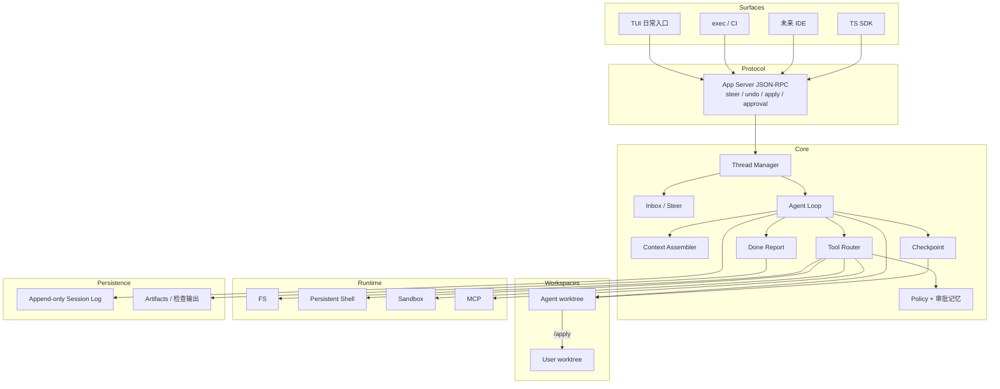

# 架构草图

本文是 [技术方案](./tech-proposal.md) 的实现级附录。实现时以 **好用规格（U1–U10）** 为取舍：与手感冲突的抽象，后做。

## 1. 分层



四条硬边界：

| 边界 | 为什么拆 |
| --- | --- |
| Protocol / Core | TUI 和 exec 必须同一套转向与审批，否则 CI 里的 Agent 和手里的 Agent 是两个产品 |
| User workspace / Agent workspace | 弄脏用户 tree 是信任事故 |
| Loop / Runtime provider | 本地、Docker、VM 只换执行面 |
| Loop / Session log | 机器可死，会话可 resume、undo、replay |

## 2. 核心对象

```text
UserWorkspace    用户当前目录（可能脏）
AgentWorkspace   本线程独占的 git worktree 或副本
Thread           持久会话（mode: ask|plan|agent）
Turn             一次用户输入触发的工作（可被 steer 插入）
Step             一次模型请求 + 并行/串行工具
Item             user / assistant / tool / approval / diff / checkpoint / done_report
Checkpoint       Turn 结束时 AgentWorkspace + 会话投影的快照
DoneReport       改了什么、跑了什么、能不能 apply
```

Item 生命周期：

```text
started → delta* → completed
          ↘ failed / interrupted
```

客户端只渲染 Item。Steer 不是新协议物种，它是 `turn/interrupt` + 一条新的 user item。

## 3. Agent Loop（含转向与收工）

```text
turn/start
  claim inbox
  assemble prompt                # 前缀稳定
  loop step:
    if cancelled: interrupt
    llm/stream (abortable)
    只读工具并行 → 写工具按文件串行
      policy → approval memory → execute on AgentWorkspace → truncate to disk
    if inbox has steer: next step 吃新约束
    if context pressure: compact
  if agent 且有改动且无 checks: 注入 verify nudge，再开 step
  emit done_report
  checkpoint
turn/end
```

实现约束：

1. 旧 prompt 是新 prompt 的精确前缀，直到 compaction。
2. 模型看见的每一段都能从 jsonl 重建。
3. 大输出落盘；prompt 只留退出码 + 尾部 + 路径。
4. **Steer 在 step 边界生效，取消推理立即生效。** 不要等整个 Turn。
5. Loop 只读写 AgentWorkspace。`/apply` 是 Workspace 层操作，不是模型工具。
6. Compaction 保留：计划、最近 N 步、最新 Done Report / 检查摘要。丢掉这些，undo 和收工都会瞎。

## 4. 工具面

v1 模型可见工具。`apply` / `undo` / `fork` 是 **用户命令**，不要做成模型可随便调用的 tool（模型一慌就会 apply）。

| 工具 | 并行 | 要点 |
| --- | --- | --- |
| `read_file` | 只读并行 | 带行号，默认 ~200 行 |
| `grep` | 只读并行 | file:line + 短 snippet，封顶 |
| `glob` | 只读并行 | 限制深度和命中 |
| `str_replace` / `write_file` | 同文件串行 | 失败回邻域；禁止无匹配整文件覆盖 |
| `bash` | 默认串行 | 持久 cwd/env；可杀；空输出有说明 |
| `update_plan` | — | JSON；TUI 可编辑后再跑 |
| `web_search` / `web_fetch` | 需审批 | 可关 |
| `delegate` | P4 | 独立 thread，只回摘要 |
| `ask_user` | — | 本地弹；云端慎用 |

后期：browser、`run_code`（减少 round-trip）、MCP 白名单。

## 5. 协议

JSON-RPC 2.0。本地 stdio JSONL；云端 WebSocket / HTTP+SSE 桥同一方法。

### 5.1 客户端 → 服务端

| 方法 | 含义 |
| --- | --- |
| `initialize` | cwd、模型、mode、是否 in-place（默认否） |
| `thread/start` | 创建会话，分配 AgentWorkspace |
| `thread/resume` | 恢复 |
| `thread/fork` | 在 checkpoint 分叉 |
| `turn/start` | 用户输入（含 @path 附件） |
| `turn/interrupt` | 立即取消推理，并请求杀命令 |
| `turn/steer` | 不打断当前 tool，插入 inbox |
| `approval/respond` | allow / deny / allow_session |
| `workspace/undo` | 回上一个 checkpoint |
| `workspace/apply` | 合回 UserWorkspace |
| `thread/items/list` | 断线重连 |

### 5.2 服务端 → 客户端

| 通知 | 含义 |
| --- | --- |
| `item/started` `item/delta` `item/completed` | 流式原子 |
| `approval/request` | 反向 RPC，暂停 loop |
| `diff/updated` | AgentWorkspace 相对基线的 diff |
| `plan/updated` | 结构化计划 |
| `done_report` | 收工证据 |
| `checkpoint/created` | 可供 undo 的点 |
| `turn/completed` / `turn/interrupted` | 结束 |

## 6. Workspace Provider

```ts
interface WorkspaceProvider {
  userRoot: string
  agentRoot: string
  beginThread(threadId: string): Promise<void>     // git worktree 或 copy
  checkpoint(label: string): Promise<CheckpointId>
  restore(id: CheckpointId): Promise<void>         // undo
  applyToUser(): Promise<ApplyResult>              // merge / 冲突则停
  listDiff(): Promise<DiffStat>
}

interface ExecutionProvider {
  readFile(path: string, range?: LineRange): Promise<FileSlice>
  writeFile(path: string, content: string): Promise<void>
  exec(req: ExecRequest): Promise<ExecResult>
  kill(execId: string): Promise<void>
}
```

路径策略：工具参数里的路径相对 AgentWorkspace。试图用 `../` 逃到 UserWorkspace 或家目录 → policy deny。

权限档位：

| 档位 | 写 | 网 | 谁用 |
| --- | --- | --- | --- |
| `read-only` | 否 | 否 | Ask / Plan |
| `workspace-write` | 仅 AgentWorkspace | 默认关 | **Agent 默认** |
| `full-access` | 是 | 是 | 显式 `/yolo` 或 CI 配置 |

## 7. Context 组装顺序

顺序冻结。后出现的更具体。

```text
1. model base instructions          # 含：验证契约、小 diff、不要动无关文件
2. tool schemas
3. sandbox / permission instructions
4. developer instructions
5. project docs                     # AGENTS.md root → cwd
6. skill catalog                    # name + description
7. environment_context              # agent cwd, user cwd, git dirty 提示, mode
8. session history
9. user turn input / steer
10. verify nudge                    # 仅当收工缺证据，确定性插入
```

`environment_context` 必须告诉模型：你在 worktree 里，用户原目录可能有未提交改动，**不要去碰**。

## 8. 仓库目录

按手感迭代边界拆，不要按插件拆：

```text
harness/
  packages/
    core/              # loop, inbox, checkpoint, done report, context
    tools/
    protocol/
    workspace/         # worktree / copy / apply / undo
    runtime-local/
    runtime-docker/
    adapters/
    tui/               # 日常入口
    cli/               # exec 无头
    sdk/
  eval/
    usability/         # U1–U10 脚本（脏树、steer、undo）
    tasks/
    fixtures/
  docs/
```

语言：Core / TUI / Protocol 用 TypeScript；Eval 可用 Python；Sandbox executor 需要时再 Rust。

## 9. 会话存储

```text
$HARNESS_HOME/threads/<thread_id>/
  header.json              # mode, model, userRoot, agentRoot
  session.jsonl
  checkpoints/
  artifacts/               # 测试输出、截断日志
```

- 只追加 jsonl
- checkpoint 记录：jsonl 偏移 + worktree 快照 id
- undo = restore 快照 + 截断投影（原 jsonl 保留，标记 rewind，便于审计）
- fork = 新 thread + 拷贝截断前缀 + 新 worktree

## 10. 评测入口

```bash
# 模型榜
harness exec --profile minimal --model <id> --task-file eval/tasks/fix-failing-tests.md

# harness 榜（含脏工作区）
harness exec --profile standard --dirty-user-tree --model <id> --task-file eval/tasks/fix-failing-tests.md

# 手感
harness exec --eval-usability eval/usability/
```

任何「我们更好用」必须同时报：模型榜、harness 榜、U 指标。缺 U 指标的发布说明视为不合格。
