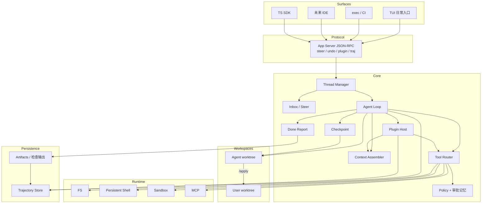

# 架构草图

本文是 [技术方案](./tech-proposal.md) 的实现级附录。实现时以 **好用规格（U1–U12）** 为取舍：与手感冲突的抽象，后做。插件和轨迹是 v1 能力，不是后补模块。

## 1. 分层



硬边界：

| 边界 | 为什么拆 |
| --- | --- |
| Protocol / Core | TUI 和 exec 必须同一套转向与审批，否则 CI 里的 Agent 和手里的 Agent 是两个产品 |
| User workspace / Agent workspace | 弄脏用户 tree 是信任事故 |
| Loop / Runtime provider | 本地、Docker、VM 只换执行面 |
| Loop / Trajectory | 机器可死；插件可换版本；事实必须能 dry replay |
| Plugin / Loop | 业务扩展不 fork 内核；replay 才有稳定语义 |

## 2. 核心对象

```text
UserWorkspace    用户当前目录（可能脏）
AgentWorkspace   本线程独占的 git worktree 或副本
Thread           持久会话（mode: ask|plan|agent）
Turn             一次用户输入触发的工作（可被 steer 插入）
Step             一次模型请求 + 并行/串行工具
Item             user / assistant / tool / approval / diff / checkpoint / done_report / plugin
Checkpoint       Turn 结束时 AgentWorkspace + 轨迹投影的快照
DoneReport       改了什么、跑了什么、能不能 apply
Plugin           声明了 kind + permissions 的扩展包（tool/skill/hook/mcp/command/adapter）
Trajectory       一次 run 的事实源：header（含 plugin_lock）+ events + artifacts + outcome
```

Item 生命周期：

```text
started → delta* → completed
          ↘ failed / interrupted
```

客户端只渲染 Item。Steer 不是新协议物种，它是 `turn/interrupt` + 一条新的 user item。

## 3. Agent Loop（含转向与收工）

```text
turn/start
  claim inbox
  assemble prompt                # 前缀稳定
  loop step:
    if cancelled: interrupt
    llm/stream (abortable)
    只读工具并行 → 写工具按文件串行
    policy → plugin hooks → approval memory → execute on AgentWorkspace → truncate to disk
    每步结果 append 到 Trajectory（source=tool|plugin|policy）
    if inbox has steer: next step 吃新约束
    if context pressure: compact
  if agent 且有改动且无 checks: 注入 verify nudge，再开 step
  emit done_report
  checkpoint
turn/end
```

实现约束：

1. 旧 prompt 是新 prompt 的精确前缀，直到 compaction。
2. 模型看见的每一段都能从 Trajectory 重建。运行时可以断言这一点。
3. 大输出落盘为 artifact，轨迹里留指针；prompt 只留退出码 + 尾部 + 路径。
4. **Steer 在 step 边界生效，取消推理立即生效。** 不要等整个 Turn。
5. Loop 只读写 AgentWorkspace。`/apply` 是 Workspace 层操作，不是模型工具。
6. Compaction 保留：计划、最近 N 步、最新 Done Report / 检查摘要。丢掉这些，undo 和收工都会瞎。
7. 插件经 Plugin Host 注册到 Router / Hooks / Skills；禁止插件替换 loop。
8. 线程启动时冻结 `plugin_lock` 写入轨迹 header。中途热加载要追加 `plugin/change` 事件，否则 replay 无效。

## 4. 工具面

v1 模型可见工具。`apply` / `undo` / `fork` 是 **用户命令**，不要做成模型可随便调用的 tool（模型一慌就会 apply）。

| 工具 | 并行 | 要点 |
| --- | --- | --- |
| `read_file` | 只读并行 | 带行号，默认 ~200 行 |
| `grep` | 只读并行 | file:line + 短 snippet，封顶 |
| `glob` | 只读并行 | 限制深度和命中 |
| `str_replace` / `write_file` | 同文件串行 | 失败回邻域；禁止无匹配整文件覆盖 |
| `bash` | 默认串行 | 持久 cwd/env；可杀；空输出有说明 |
| `update_plan` | — | JSON；TUI 可编辑后再跑 |
| `web_search` / `web_fetch` | 需审批 | 可关 |
| `delegate` | P4 | 独立 thread，只回摘要 |
| `ask_user` | — | 本地弹；云端慎用 |

后期：browser、`run_code`（减少 round-trip）。MCP 不以「额外白名单配置」存在，而以 `mcp` 插件 kind 接入，权限和轨迹与内置工具相同。

插件提供的 tool 走同一 Router：schema 进 prompt 的 tool schemas 段，调用进轨迹 `source=tool`，hook 改写进 `source=plugin`。同名冲突按加载顺序覆盖，并在 header.plugin_lock 记录赢家。

## 5. 协议

JSON-RPC 2.0。本地 stdio JSONL；云端 WebSocket / HTTP+SSE 桥同一方法。

### 5.1 客户端 → 服务端

| 方法 | 含义 |
| --- | --- |
| `initialize` | cwd、模型、mode、是否 in-place（默认否） |
| `thread/start` | 创建会话，分配 AgentWorkspace |
| `thread/resume` | 恢复 |
| `thread/fork` | 在 checkpoint 分叉 |
| `turn/start` | 用户输入（含 @path 附件） |
| `turn/interrupt` | 立即取消推理，并请求杀命令 |
| `turn/steer` | 不打断当前 tool，插入 inbox |
| `approval/respond` | allow / deny / allow_session |
| `workspace/undo` | 回上一个 checkpoint |
| `workspace/apply` | 合回 UserWorkspace |
| `plugin/list` | 当前线程 plugin_lock |
| `plugin/enable` `plugin/disable` | 改锁并写 `plugin/change`（会断 cache） |
| `traj/show` | 按 source / 时间过滤事件 |
| `traj/export` | 打 `.traj` 包 |
| `traj/replay` | `dry` 或 `live` |
| `traj/diff` | 两条轨迹对比 |
| `thread/items/list` | 断线重连（items 是轨迹的 UI 投影） |

### 5.2 服务端 → 客户端

| 通知 | 含义 |
| --- | --- |
| `item/started` `item/delta` `item/completed` | 流式原子 |
| `approval/request` | 反向 RPC，暂停 loop |
| `diff/updated` | AgentWorkspace 相对基线的 diff |
| `plan/updated` | 结构化计划 |
| `done_report` | 收工证据 |
| `checkpoint/created` | 可供 undo 的点 |
| `plugin/event` | load / error / hook_block / change |
| `turn/completed` / `turn/interrupted` | 结束 |

## 6. Workspace Provider

```ts
interface WorkspaceProvider {
  userRoot: string
  agentRoot: string
  beginThread(threadId: string): Promise<void>     // git worktree 或 copy
  checkpoint(label: string): Promise<CheckpointId>
  restore(id: CheckpointId): Promise<void>         // undo
  applyToUser(): Promise<ApplyResult>              // merge / 冲突则停
  listDiff(): Promise<DiffStat>
}

interface ExecutionProvider {
  readFile(path: string, range?: LineRange): Promise<FileSlice>
  writeFile(path: string, content: string): Promise<void>
  exec(req: ExecRequest): Promise<ExecResult>
  kill(execId: string): Promise<void>
}
```

路径策略：工具参数里的路径相对 AgentWorkspace。试图用 `../` 逃到 UserWorkspace 或家目录 → policy deny。

权限档位：

| 档位 | 写 | 网 | 谁用 |
| --- | --- | --- | --- |
| `read-only` | 否 | 否 | Ask / Plan |
| `workspace-write` | 仅 AgentWorkspace | 默认关 | **Agent 默认** |
| `full-access` | 是 | 是 | 显式 `/yolo` 或 CI 配置 |

## 7. Context 组装顺序

顺序冻结。后出现的更具体。

```text
1. model base instructions          # 含：验证契约、小 diff、不要动无关文件
2. tool schemas
3. sandbox / permission instructions
4. developer instructions
5. project docs                     # AGENTS.md root → cwd
6. skill catalog                    # 内置 + 插件 skill 的 name + description
7. environment_context              # agent cwd, user cwd, git dirty 提示, mode, plugin_lock 摘要
8. session history                  # 从轨迹投影，禁止旁路注入
9. user turn input / steer
10. verify nudge                    # 仅当收工缺证据，确定性插入
```

`environment_context` 必须告诉模型：你在 worktree 里，用户原目录可能有未提交改动，**不要去碰**。

## 8. 仓库目录

按手感迭代边界拆，不要按插件拆：

```text
harness/
  packages/
    core/              # loop, inbox, checkpoint, done report, context
    plugins/           # Plugin Host、manifest 校验、权限
    tools/             # 内置 ACI；插件 tool 实现不放这里
    protocol/
    workspace/
    runtime-local/
    runtime-docker/
    adapters/          # 也可被 adapter 插件替换
    tui/
    cli/               # exec + traj 子命令
    sdk/
  bundled-plugins/     # 官方 skill/hook 样例，证明加载路径
  eval/
    usability/         # U1–U12（含插件装载、dry replay）
    tasks/
    fixtures/
    trajectories/      # 黄金 .traj
  docs/
```

语言：Core / TUI / Protocol 用 TypeScript；Eval 可用 Python；Sandbox executor 需要时再 Rust。

## 9. 轨迹存储

活线程与导出包是同一套事实，只是打包边界不同。

```text
$HARNESS_HOME/threads/<thread_id>/
  header.json              # mode, model, userRoot, agentRoot, plugin_lock
  session.jsonl            # 轨迹事件
  checkpoints/
  artifacts/
  plugins.lock.json        # id@version + 内容哈希，与 header 一致

导出：
  something.traj           # tar/zip：header + jsonl + artifacts + plugins.lock
```

规则：

- 只追加 jsonl；rewind 追加 `source=checkpoint` 的 rewind 事件，不改写历史
- checkpoint 记录：jsonl 偏移 + worktree 快照 id
- undo = restore 快照 + 投影 rewind
- fork / `traj fork --at` = 新 thread + 前缀拷贝 + 新 worktree + 新轨迹 id（header 记 parent）
- dry replay 只读 jsonl 重建 prompt，禁止执行 provider
- live replay 必须校验 plugin_lock 与 git revision，对不上则失败
- 插件 load/error/hook 全部落 `source=plugin`

## 10. 插件加载

```ts
interface PluginManifest {
  id: string
  version: string
  kinds: Array<"tool" | "skill" | "hook" | "mcp" | "command" | "adapter">
  permissions: string[]
  tools?: { name: string; entry: string }[]
  hooks?: { event: "preToolUse" | "postToolUse" | "onStop" | "onSessionStart"; entry: string }[]
  skills?: string[]
  mcp?: { command: string; args?: string[] }
}

interface PluginHost {
  load(roots: string[]): Promise<PluginLock>
  schemas(): ToolSchema[]          // 进 prompt
  skillCatalog(): SkillMeta[]
  hooks: HookBus
}
```

加载根：bundled → `~/.harness/plugins` → `<repo>/.harness/plugins` → CLI override。  
Agent plane 的 tool/mcp 按 thread isolate；Host plane 的 adapter/全局 hook 进程单例。

## 11. 评测入口

```bash
# 模型榜
harness exec --profile minimal --model <id> --task-file eval/tasks/fix-failing-tests.md

# harness 榜（含脏工作区）
harness exec --profile standard --dirty-user-tree --model <id> --task-file eval/tasks/fix-failing-tests.md

# 手感 + 插件 + 轨迹
harness exec --eval-usability eval/usability/
harness traj replay --dry eval/trajectories/fix-login.traj
harness traj diff run-a.traj run-b.traj
```

任何「我们更好用」必须同时报：模型榜、harness 榜、U 指标，并附轨迹。缺轨迹的发布说明视为不合格。
