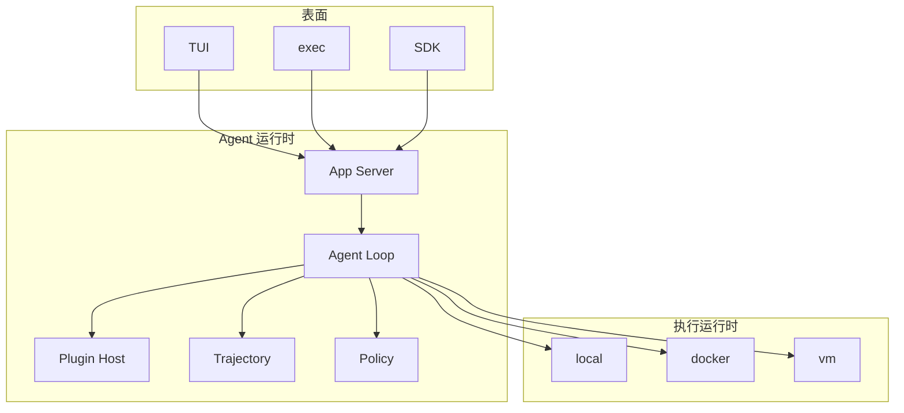

# 架构说明

配套 [技术方案](./tech-proposal.md)。本文冻结 **数据、协议、包边界**。实现按方案 §18.3 切片，但不得破坏本文不变量。

---

## 1. 进程与包

```text
harness/
  packages/
    core/               # loop, inbox, context, checkpoint, done report, 不变量断言
    protocol/           # JSON-RPC schema 与 App Server
    plugins/            # Plugin Host、manifest、权限、lock
    trajectory/         # 读写 jsonl、export/import、dry/live replay、diff
    workspace/          # worktree / copy / apply / undo
    runtime-local/      # 本地执行运行时
    runtime-docker/
    runtime-vm/         # 接口 + 空实现，直到 P5
    adapters/           # openai-compatible 内置
    tools/              # 内置 ACI
    tui/
    cli/                # exec、traj、plugin 子命令
    sdk/
  bundled-plugins/
  eval/
    tasks/
    fixtures/
    usability/          # U1–U12
    trajectories/       # 黄金 .traj
  docs/
```

依赖方向：`tui/cli/sdk` → `protocol` → `core` → `plugins` `trajectory` `workspace` `tools` `adapters` → `runtime-*`。

禁止业务代码 import `core`。

---

## 2. 核心对象

```text
UserWorkspace     用户 cwd，可能脏
AgentWorkspace    线程独占
Thread            持久会话
Turn              一次用户输入
Step              一次模型调用 + 工具
Item              UI 投影（started/delta/completed|failed|interrupted）
Checkpoint        agentRoot 快照 + jsonl 偏移
DoneReport        收工证据
PluginLock        id@version+sha256[]
Trajectory        header + events + artifacts + outcome
```

Thread header：

```json
{
  "thread_id": "thr_...",
  "harness_version": "0.0.0",
  "profile": "standard",
  "mode": "agent",
  "model": { "adapter": "openai-compat", "id": "..." },
  "user_root": "/abs/user",
  "agent_root": "/abs/worktree",
  "execution": { "provider": "local" },
  "plugin_lock": [{ "id": "acme.test", "version": "1.2.0", "sha256": "..." }],
  "git_head": "abc123",
  "env_hash": "..."
}
```

---

## 3. 分层



---

## 4. Loop 不变量（测试锁死）

1. compact 前 prompt 前缀稳定
2. `visible_to_model(step) ⊆ reconstruct(traj, step)`
3. 文件写入路径 ⊆ AgentWorkspace
4. 模型工具名 ∈ 内置 ACI ∪ plugin_lock 中的 tool
5. `/apply` `/undo` 不出现在 tool schemas
6. plugin_lock 在 `thread/start` 冻结；之后只能经 `plugin/change` 事件变更
7. live replay 的 lock 与 git_head 必须相等，否则抛 `ReplayLockMismatch`

---

## 5. 上下文组装（顺序锁死）

```text
1 model_instructions
2 tool_schemas
3 permission_instructions
4 developer_instructions
5 agents_md
6 skill_catalog
7 environment_context
8 history_from_traj
9 user_or_steer
10 verify_nudge          # 可选，运行时插入
```

`environment_context` 必须包含：你在 AgentWorkspace；UserWorkspace 可能脏；不要碰用户目录；当前 mode；plugin_lock 摘要。

---

## 6. 执行运行时接口

```ts
type ExecRequest = {
  id: string
  command: string[]
  cwd?: string
  timeout_ms?: number
  env?: Record<string, string>   // 已过滤的注入
}

type ExecResult = {
  exit_code: number
  artifact_path?: string         // 超限则全文在此
  tail: string
  truncated: boolean
}

interface ExecutionProvider {
  id: "local" | "docker" | "vm"
  start(ctx: ThreadContext): Promise<void>
  stop(): Promise<void>
  readFile(path: string, range?: { start: number; end: number }): Promise<{ text: string; start: number; end: number }>
  writeFile(path: string, content: string): Promise<void>
  exec(req: ExecRequest): Promise<ExecResult>
  kill(execId: string): Promise<void>
  listDiff(since?: string): Promise<{ files: { path: string; hunks: number }[] }>
}

interface WorkspaceProvider {
  beginThread(threadId: string): Promise<{ agentRoot: string }>
  checkpoint(label: string): Promise<string>
  restore(id: string): Promise<void>
  applyToUser(): Promise<{ ok: true } | { ok: false; conflicts: string[] }>
}
```

`local`：git worktree（失败则报错，不静默 in-place）。  
`docker`：按 `.harness/env.toml` 或评测 fixture 的 image。  
`vm`：P5 实现，P0 起保留 id。

---

## 7. 插件

### 7.1 Manifest

```ts
type PluginKind = "tool" | "skill" | "hook" | "mcp" | "command" | "adapter"

interface PluginManifest {
  id: string
  version: string
  kinds: PluginKind[]
  permissions: string[]
  tools?: { name: string; entry: string }[]
  hooks?: { event: HookEvent; entry: string }[]
  skills?: string[]
  mcp?: { command: string; args?: string[] }
  adapter?: { entry: string }
}

type HookEvent =
  | "onSessionStart"
  | "preToolUse"
  | "postToolUse"
  | "onStop"
  | "onCompact"
```

加载根（后者覆盖同名 tool/command）：

```text
bundled-plugins/
~/.harness/plugins/
<repo>/.harness/plugins/
--plugin-path 覆盖
```

### 7.2 Host

```ts
interface PluginHost {
  load(roots: string[]): Promise<PluginLock>
  lock(): PluginLock
  schemas(): ToolSchema[]
  skillCatalog(): { name: string; description: string; path: string }[]
  commands(): { name: string; run: (args: string) => Promise<void> }[]
  hooks: {
    emit<T>(event: HookEvent, payload: T): Promise<T>  // waterfall
  }
}
```

Agent plane 的 tool/mcp 每 Thread 独立子进程或独立实例。Host plane 的 adapter、全局 hook 进程单例。

权限字符串 v1：`workspace-write` `workspace-read` `shell` `shell:test` `net` `net:<host>` `secrets:<name>`。

---

## 8. 轨迹

### 8.1 落盘

```text
$HARNESS_HOME/threads/<thread_id>/
  header.json
  session.jsonl
  plugins.lock.json
  outcome.json
  checkpoints/<id>/
  artifacts/<event_id>/
```

jsonl 一行一事：

```json
{
  "id": "evt_...",
  "ts": "2026-09-17T00:00:00.000Z",
  "turn_id": "trn_...",
  "step_id": "stp_...",
  "source": "tool",
  "payload": {}
}
```

`source` 枚举：`system` `user` `steer` `assistant` `reasoning` `tool` `plugin` `policy` `compact` `checkpoint` `done_report` `mode` `error`。

### 8.2 Replay

- **dry**：按事件重建 messages+tools；不调 ExecutionProvider；与当时 `system`/`tool` 哈希比对。
- **live**：校验 `plugin_lock` 与 `git_head`；重建工作区到 head；重放 tool；新轨迹 `parent_traj` 指向源。

### 8.3 Diff

输出：tool 序列编辑距离、changed_files 对称差、token 差、越权事件差、Done Report 差。

---

## 9. 协议方法

JSON-RPC 2.0。请求必须先 `initialize`。

### 9.1 请求

| method | params 要点 | result |
| --- | --- | --- |
| `initialize` | cwd, profile, mode, in_place?, execution? | harness_version, capabilities |
| `thread/start` | — | thread_id, agent_root, plugin_lock |
| `thread/resume` | thread_id | header |
| `thread/fork` | thread_id, at_event_id? | new thread_id |
| `thread/list` | — | headers[] |
| `turn/start` | text, attachments[] | turn_id |
| `turn/interrupt` | turn_id | ok |
| `turn/steer` | text | ok |
| `approval/respond` | request_id, allow\|deny\|allow_session | ok |
| `workspace/undo` | checkpoint_id? | checkpoint_id |
| `workspace/apply` | — | ApplyResult |
| `plugin/list` | — | plugin_lock |
| `plugin/enable` | id | 新 lock（写 plugin/change） |
| `plugin/disable` | id | 新 lock |
| `traj/show` | source[]?, since? | events[] |
| `traj/export` | path | path |
| `traj/replay` | path, mode=dry\|live | new thread_id or prompt_hash |
| `traj/diff` | a, b | diff |
| `shutdown` | — | ok |

### 9.2 通知

| method | 含义 |
| --- | --- |
| `item/started` `item/delta` `item/completed` | UI 原子 |
| `approval/request` | **反向请求**，暂停 loop |
| `diff/updated` | AgentWorkspace 相对基线 |
| `plan/updated` | 结构化计划 |
| `done_report` | 收工 |
| `checkpoint/created` | undo 点 |
| `plugin/event` | load / error / hook_block / change |
| `turn/completed` `turn/interrupted` | 结束 |

Item.type：`user` `assistant` `reasoning` `tool` `approval` `diff` `plan` `checkpoint` `done_report` `plugin`。

---

## 10. 内置工具 schema 要点

| name | 必填 | 约束 |
| --- | --- | --- |
| `read_file` | path | 可选 start/end；默认 200 行 |
| `grep` | pattern | 可选 glob；max_hits |
| `glob` | pattern | max_hits |
| `str_replace` | path, old, new | old 必须唯一，否则失败+邻域 |
| `write_file` | path, content | 仅新文件或空文件；已存在非空走 str_replace |
| `bash` | command | timeout_ms；cwd ⊆ agentRoot |
| `update_plan` | plan[] | id, goal, success, status |
| `web_fetch` | url | 需 net 权限 |
| `delegate` | prompt, tools? | 返回 summary + child_traj |
| `ask_user` | question | exec 默认禁用 |

---

## 11. Done Report

```json
{
  "changed_files": ["src/a.ts"],
  "checks": [{ "cmd": ["pnpm", "test"], "exit_code": 0, "artifact": "artifacts/evt_.../stdout.txt" }],
  "residual_risks": [],
  "apply_ready": true
}
```

`apply_ready=true` 当且仅当：无未解决冲突、无失败 checks、无未审批的越权。TUI 在 false 时禁止一键 apply，除非用户强制。

---

## 12. CLI

```text
harness                         # TUI，cwd=pwd
harness exec --task FILE        # 无头；打印 traj 路径
harness traj show|export|replay|diff
harness plugin add|list
harness --profile minimal|standard|eval
harness --execution local|docker
```

`exec` 退出码：0 成功且 apply_ready；2 任务失败；3 越权或插件错误；4 轨迹写入失败（视为崩溃）。

---

## 13. 评测入口

```bash
harness exec --profile minimal  --task-file eval/tasks/fix.md
harness exec --profile standard --dirty-user-tree --task-file eval/tasks/fix.md
harness exec --eval-usability eval/usability/
harness traj replay --dry eval/trajectories/fix-login.traj
harness traj diff a.traj b.traj
```

无 `.traj` 路径打印的 run，评测 harness 丢弃。
